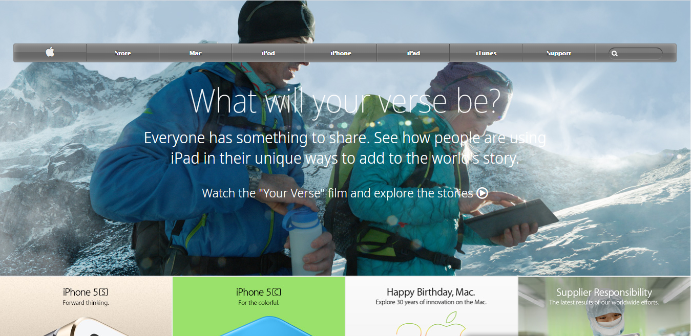

# Clone - Old Version of the Apple Website

> This is the clone of an old version of apple.com for learning CSS backgrounds and gradients.

## Built With

- HTML5, CSS3
- Flexbox

## Live Demo

[Live Demo Link](https://)

## Authors

👤
- Github: [@flpfar](https://github.com/flpfar)
- Twitter: [@flpfar](https://twitter.com/flpfar)
- Linkedin: [linkedin](https://www.linkedin.com/in/felipe-augusto-rosa-7b96a4b1)

## 🤝 Contributing

Contributions, issues and feature requests are welcome!

Feel free to check the [issues page](issues/).

## Show your support

Give a ⭐️ if you like this project!
=======
# old-apple-website-clone

